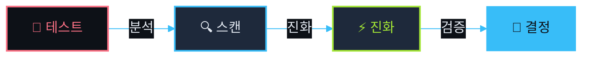
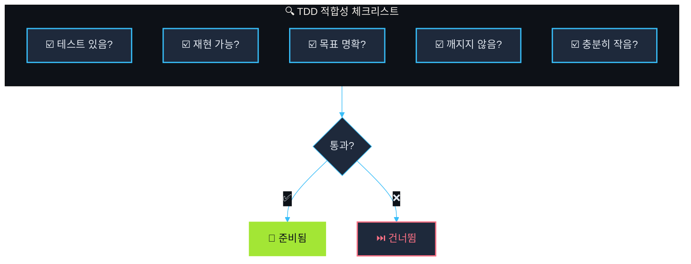
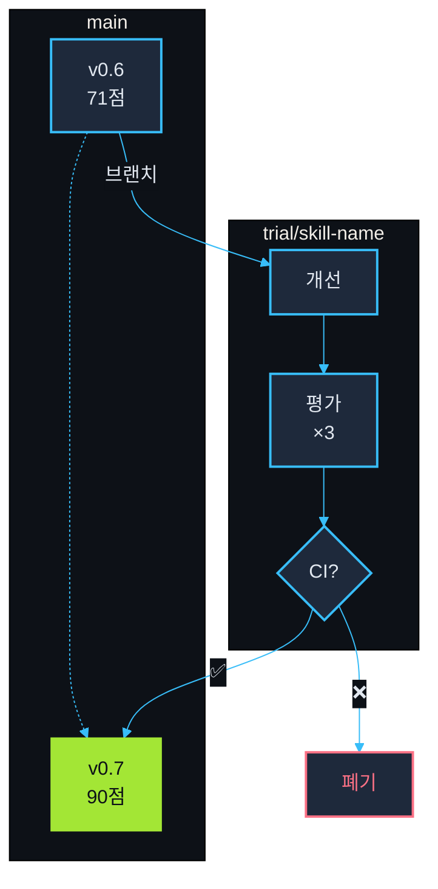
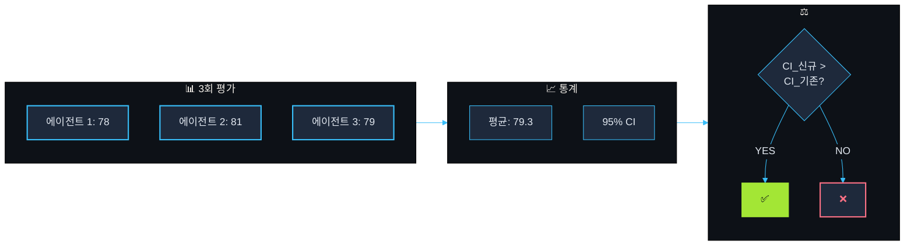
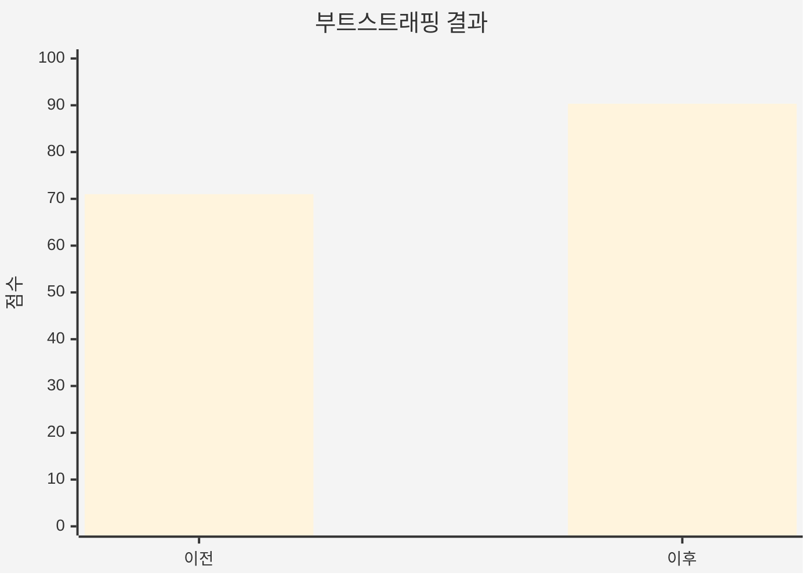
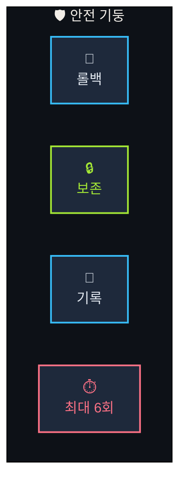
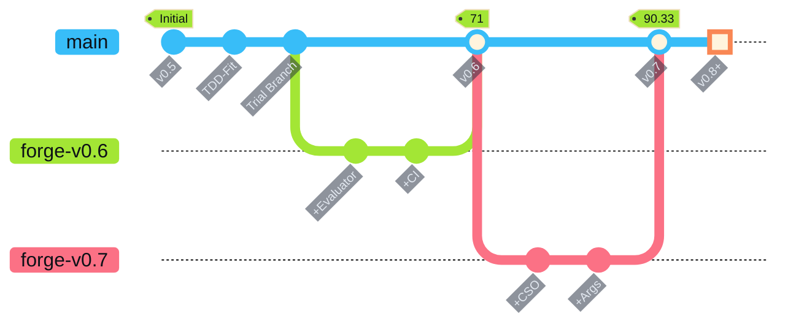
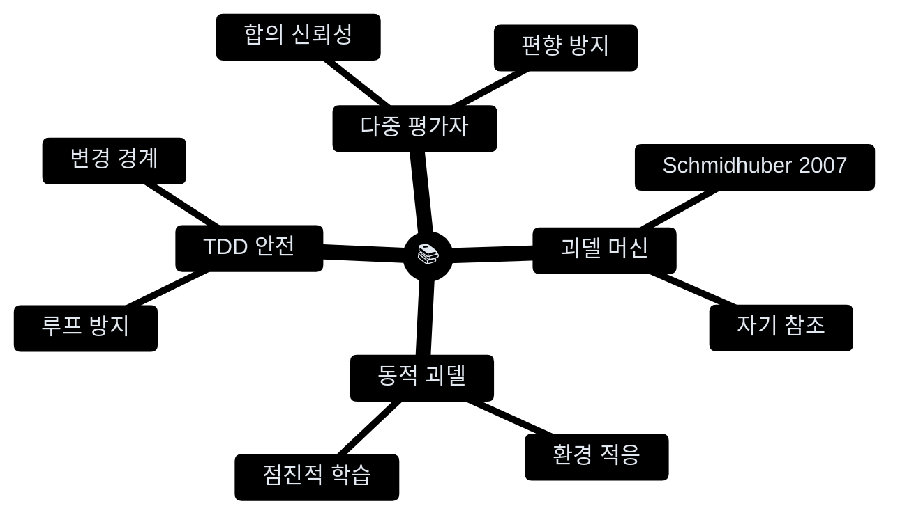

[English](README.md) | **한국어**

<div align="center">

<picture>
  <source media="(prefers-color-scheme: dark)" srcset="https://readme-typing-svg.demolab.com?font=JetBrains+Mono&weight=700&size=42&duration=3000&pause=1000&color=38BDF8&center=true&vCenter=true&width=500&lines=skill-forge">
  
</picture>

### ⟨ TDD 진화 엔진 ⟩

[](https://github.com/quantsquirrel/claude-skill-forge)
[](https://github.com/quantsquirrel/claude-skill-forge)
[](LICENSE)
[](https://github.com/quantsquirrel/claude-skill-forge)

**TDD 기반 Claude Code 스킬 자동 진화 엔진**

</div>

━━━━━━━━━━━━━━━━━━━━━━━━━━━━━━━━━━━━━━━━━━━━━━━━

## 💎 흐름



━━━━━━━━━━━━━━━━━━━━━━━━━━━━━━━━━━━━━━━━━━━━━━━━

## ⚡ 빠른 시작

```bash
# 설치
git clone https://github.com/quantsquirrel/claude-skill-forge.git \
  ~/.claude/plugins/local/skill-forge

# 실행
/skill-forge:forge --scan
```

━━━━━━━━━━━━━━━━━━━━━━━━━━━━━━━━━━━━━━━━━━━━━━━━

## 💎 기능

| 💎 투명한 검증 | ⚡ 자동 진화 |
|:---:|:---:|
| 모든 변경은 테스트로 검증 | 3회 평가 + 95% CI 자동 머지 |

| 🔄 안전한 롤백 | 📊 통계 |
|:---:|:---:|
| 실패 시 원본 보존 | 실시간 점수 추적 |

### 🔀 하이브리드 업그레이드 모드 (v0.8)

이제 두 가지 경로로 스킬을 업그레이드할 수 있습니다:

| 모드 | 조건 | 방법 |
|------|------|------|
| **TDD 모드** | 테스트 파일 존재 | 통계적 검증 (95% CI) |
| **휴리스틱 모드** | 테스트 없음 | 사용량 패턴 + 구조 분석 |

```bash
# 업그레이드 모드 확인
source hooks/lib/storage-local.sh
get_upgrade_mode "my-skill"  # 반환: TDD_FIT 또는 HEURISTIC
```

### 📊 스킬 모니터 (v0.8)

스킬 사용량을 추적하고 업그레이드 추천을 받으세요:

```
/monitor
```

출력 예시:
```
╔══════════════════════════════════════════════════════════════╗
║                    Skill Forge Monitor                        ║
╠══════════════════════════════════════════════════════════════╣
║ Skill                │ Usage │ Trend   │ Mode       │ Pri    ║
╠══════════════════════╪═══════╪═════════╪════════════╪════════╣
║ skill-forge:forge    │    45 │ ▲ +20%  │ TDD_FIT    │ MED    ║
╚══════════════════════════════════════════════════════════════╝
```

### 🎖️ 강화된 등급 시스템 (v0.8)

새로운 등급 Modifier와 SSS 티어:

| Modifier | 보너스 | 조건 |
|----------|--------|------|
| 업그레이드됨 | +1 | `upgraded: true` |
| 효율적 | +0.5 | 토큰/사용량 < 1500 |
| 상승 트렌드 | +0.5 | positive 트렌드 |
| 테스트됨 | +0.5 | 테스트 파일 존재 |

**S + Upgraded + Efficient = SSS** ★★★

━━━━━━━━━━━━━━━━━━━━━━━━━━━━━━━━━━━━━━━━━━━━━━━━

## 🔍 TDD 적합성 평가



━━━━━━━━━━━━━━━━━━━━━━━━━━━━━━━━━━━━━━━━━━━━━━━━

## ⚡ 시험 브랜치 전략



━━━━━━━━━━━━━━━━━━━━━━━━━━━━━━━━━━━━━━━━━━━━━━━━

## 📊 통계적 검증



━━━━━━━━━━━━━━━━━━━━━━━━━━━━━━━━━━━━━━━━━━━━━━━━

## 📊 결과



**+27% 향상** — skill-forge가 스스로를 진화시켰습니다

━━━━━━━━━━━━━━━━━━━━━━━━━━━━━━━━━━━━━━━━━━━━━━━━

## 🛡️ 안전장치



━━━━━━━━━━━━━━━━━━━━━━━━━━━━━━━━━━━━━━━━━━━━━━━━

## 🚀 명령어

| 명령어 | 설명 |
|--------|------|
| `/skill-forge:forge --scan` | 🔍 업그레이드 가능한 스킬 스캔 |
| `/skill-forge:forge <skill>` | ⚡ 특정 스킬 단조 |
| `/skill-forge:forge --history` | 📜 단조 기록 보기 |
| `/skill-forge:forge --watch` | 👁️ 스킬 모니터링 |

━━━━━━━━━━━━━━━━━━━━━━━━━━━━━━━━━━━━━━━━━━━━━━━━

## 📈 히스토리



━━━━━━━━━━━━━━━━━━━━━━━━━━━━━━━━━━━━━━━━━━━━━━━━

## 📚 이론



━━━━━━━━━━━━━━━━━━━━━━━━━━━━━━━━━━━━━━━━━━━━━━━━

<div align="center">

**영감** [skill-up](https://github.com/BumgeunSong/skill-up)

**Claude Code** · **MIT License**

</div>
