[English](README.md) | **한국어**

<div align="center">

```
                    ╔═══════════════════════════════════════╗
                    ║                                       ║
        ⚒️          ║     S K I L L   F O R G E            ║          🔥
                    ║                                       ║
                    ╚═══════════════════════════════════════╝
                                    ▲
                               ╱────┴────╲
                              ╱   모루    ╲
                             ▕  ▓▓▓▓▓▓▓▓▓  ▏
                              ╲___________╱
```

### 불꽃 속에서 AI 스킬을 단조하다

**Claude Code를 위한 TDD 기반 스킬 자동 업그레이드 플러그인**

[](LICENSE)
[](https://github.com/quantsquirrel/claude-skill-forge)
[](https://claude.ai)
[](https://github.com/quantsquirrel/claude-skill-forge)
[](https://github.com/quantsquirrel/claude-skill-forge)

<br/>

> *"마스터 대장장이가 강철을 담금질하듯, skill-forge는 당신의 AI 스킬을*
> *달구고, 두드리고, 식혀서 더 강하게 만듭니다."*

<br/>

[⚡ 빠른 시작](#-대장간에-불을-지피다) · [🔥 단조 과정](#-단조-과정) · [📊 결과](#-불꽃의-증거)

</div>

---

<table>
<tr>
<td width="50%">

### 🏛️ 검증된 이론 기반

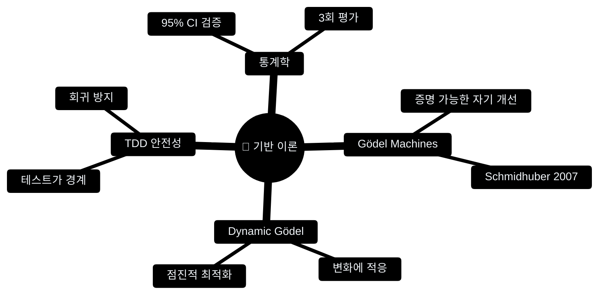

</td>
<td width="50%">

### 📊 불꽃의 증거

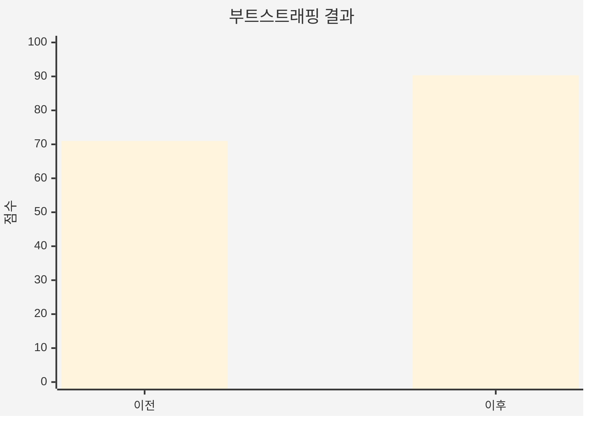

**+27% 향상** — *skill-forge가 스스로를 단조했습니다*

</td>
</tr>
</table>

---

## ⚡ 대장간에 불을 지피다

```bash
# 대장간을 작업실로 소환
git clone https://github.com/quantsquirrel/claude-skill-forge.git \
  ~/.claude/plugins/local/skill-forge

# 첫 번째 불꽃을 일으키다
/skill-forge:forge --scan
```

---

## 🔥 단조 과정

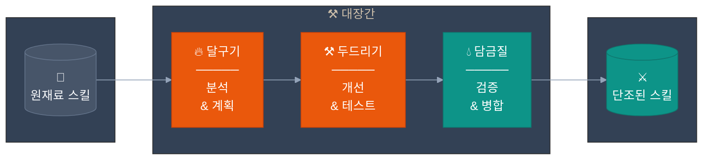

---

### 🔥 달구기: TDD-Fit 평가

스킬이 대장간에 들어가기 전, 열 테스트를 통과해야 합니다:

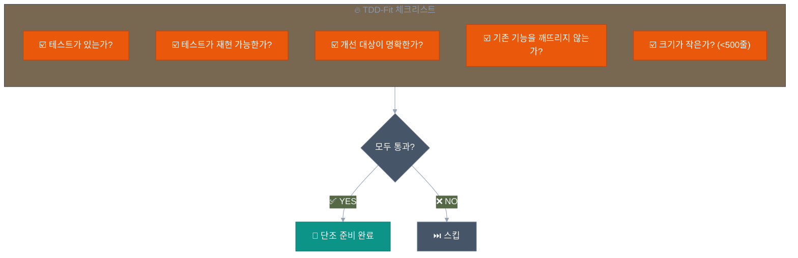

---

### ⚒️ 두드리기: Trial Branch 전략

스킬은 안전을 위해 별도의 모루(브랜치)에서 단조됩니다:

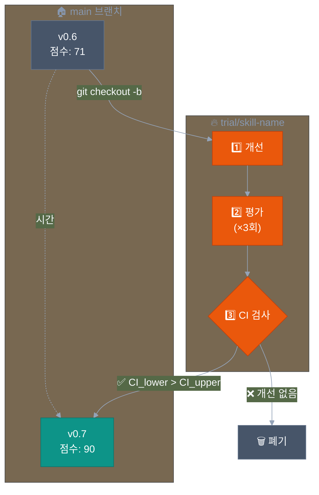

---

### 💧 담금질: 통계적 검증

통계적으로 유의미한 개선만 살아남습니다:

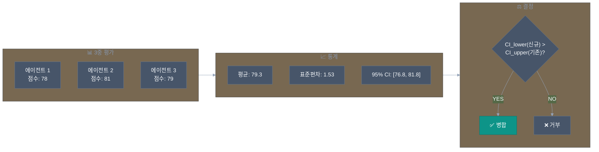

---

## ⚔️ 품질 점수화

각 스킬은 5가지 차원에서 평가됩니다:

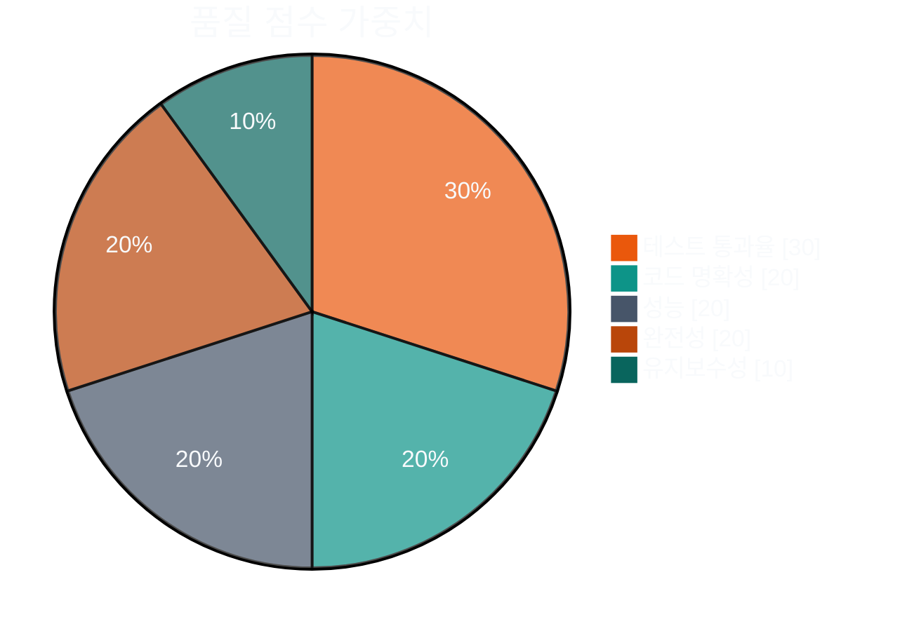

---

## 🛡️ 안전 메커니즘

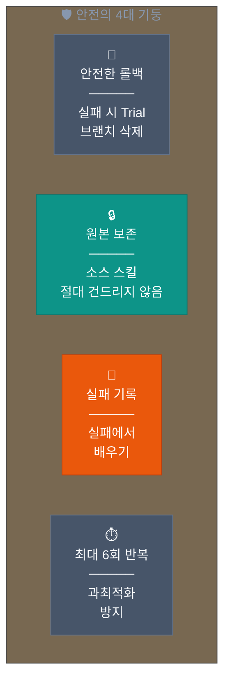

---

## 📦 설치

<details>
<summary><b>방법 1: 자동 로드 (권장)</b></summary>

```bash
git clone https://github.com/quantsquirrel/claude-skill-forge.git \
  ~/.claude/plugins/local/skill-forge
```

</details>

<details>
<summary><b>방법 2: 수동 설치</b></summary>

```bash
mkdir -p ~/.claude/plugins/local/skill-forge
cp -r skill-forge/* ~/.claude/plugins/local/skill-forge/
chmod +x ~/.claude/plugins/local/skill-forge/hooks/*.sh
```

</details>

---

## 🚀 명령어

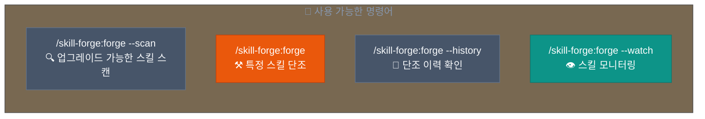

---

## 📈 단조 이력

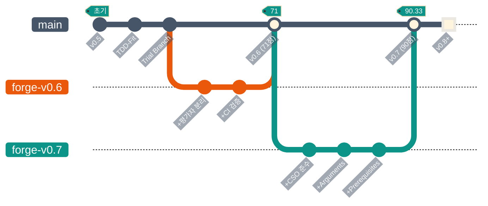

---

## 📚 전승 (참고자료)

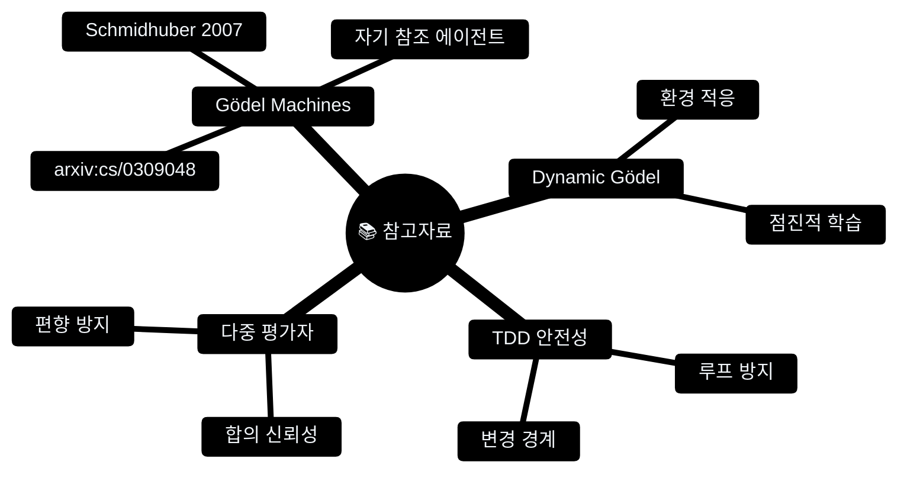

---

<div align="center">

```
        ╱╲
       ╱  ╲
      ╱ 🔥 ╲
     ╱      ╲
    ╱________╲
   ╱ ▓▓▓▓▓▓▓▓ ╲
  ╱____________╲
       ║║
    ═══╬╬═══
```

*"불꽃 속에서 단조된 스킬은 결코 지치지 않는다."*

---

[skill-up](https://github.com/BumgeunSong/skill-up)에서 영감을 받음

**Maintained by:** Claude Code · **License:** MIT

</div>
