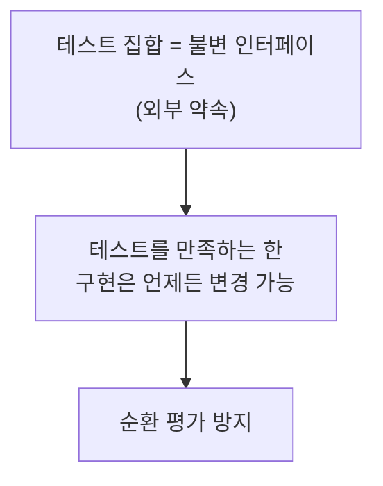
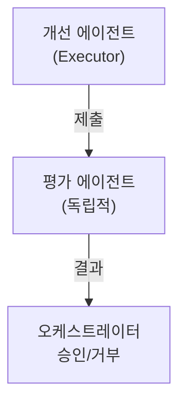
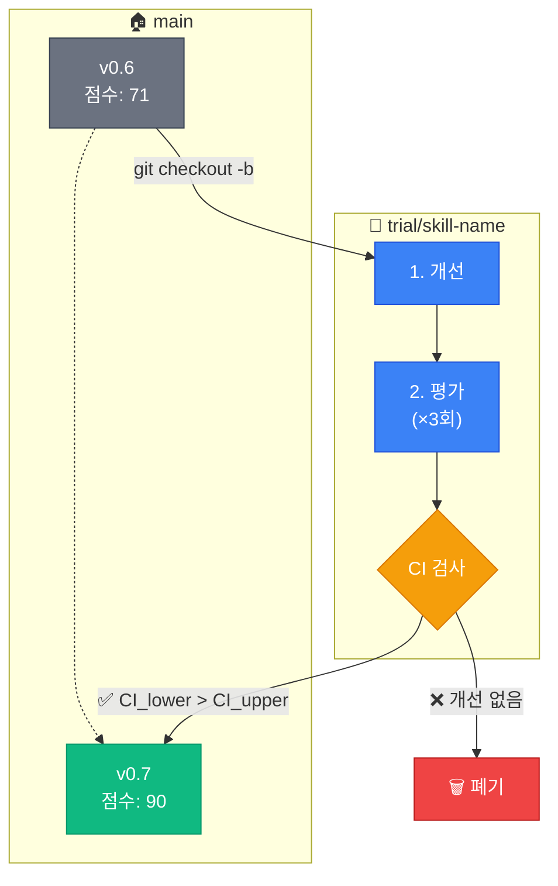
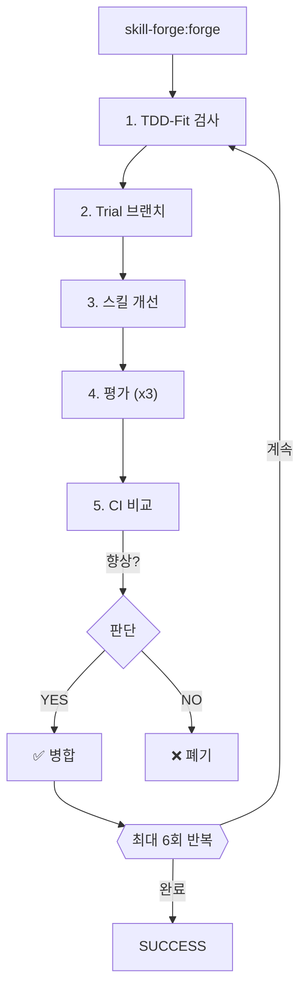

[English](README.md) | **한국어**

<div align="center">

# 🔨 skill-forge

**Claude Code를 위한 TDD 기반 스킬 자동 업그레이드 플러그인**

[](LICENSE)
[](https://github.com/quantsquirrel/claude-skill-forge)
[](https://claude.ai)
[](https://github.com/quantsquirrel/claude-skill-forge)
[](https://github.com/quantsquirrel/claude-skill-forge)

*테스트 주도 개발 원칙을 활용하여 AI 에이전트 스킬을 자동으로 분석, 평가, 개선합니다.*

> *"Claude Code 스킬을 위한 유일한 TDD 기반 자기 개선 시스템"*

[빠른 시작](#-빠른-시작) · [기능](#-핵심-기능) · [문서](#-연구-배경) · [참고자료](#-참고자료)

</div>

---

> **📚 탄탄한 연구 기반**
>
> 이 프로젝트는 검증된 이론과 연구에 기반합니다:
> | 기반 이론 | 설명 |
> |-----------|------|
> | **Gödel Machines** | 증명 가능한 자기 개선 (Schmidhuber, 2007) |
> | **Dynamic Gödel Machines** | 동적 환경에서의 점진적 최적화 |
> | **TDD 안전성** | 테스트를 통한 변경 경계 정의 |
> | **통계적 검증** | 95% 신뢰구간을 통한 향상 검증 |

---

## ⚡ 빠른 시작

```bash
# Claude 플러그인 디렉토리에 클론
git clone https://github.com/quantsquirrel/claude-skill-forge.git \
  ~/.claude/plugins/local/skill-forge

# 스킬 업그레이드 시작
/skill-forge:forge --scan
```

---

## 📋 목차

- [🔬 연구 배경](#-연구-배경)
- [🏗️ 설계 결정](#️-설계-결정)
- [✨ 핵심 기능](#-핵심-기능)
- [📦 설치법](#-설치법)
- [🚀 사용법](#-사용법)
- [📈 자체 개선 이력](#-자체-개선-이력)
- [📚 참고자료](#-참고자료)

---

## 🔬 연구 배경

### Self-Improving Skills: 자기 개선 AI의 가능성

이 플러그인은 획기적인 연구들에 영감을 받았습니다:

| 연구 | 핵심 통찰 |
|------|-----------|
| **Gödel Machines** (Schmidhuber) | AI가 자신의 알고리즘을 증명 가능하게 개선할 수 있음 |
| **Dynamic Gödel Machines** | 동적 환경에서 스킬을 재학습하고 개선하는 메커니즘 |

### TDD와 자기 참조 안전성

**핵심 통찰:** 테스트가 변경의 경계를 정의한다



### 6회 반복 최적화 곡선

| 반복 | 개선 | 상태 |
|------|------|------|
| 1-2회 | >10% 향상 | 🚀 급속 |
| 3-4회 | 5-10% | 📈 안정 |
| 5-6회 | <5% | ⚠️ 수확 체감 |
| 7회+ | 회귀 위험 | 🛑 중단 |

> 개선과 안정성의 균형을 위해 최대 **6회 반복**으로 제한합니다.

---

## 🏗️ 설계 결정

### 핵심 설계 원칙

#### 1️⃣ 평가 에이전트 분리 원칙

❌ **안전하지 않음:** 개선 에이전트 → 자신이 만든 결과를 평가 → 편향/순환

✅ **올바른 구조:**



#### 2️⃣ 복수 평가 + 신뢰구간

| 전략 | 세부 사항 |
|------|-----------|
| 평가 횟수 | 3회 독립 평가 |
| 점수 | 회당 0-100점 |
| 통계 | 평균, 표준편차, 95% CI |
| 임계값 | `CI_lower(새) > CI_upper(기존) + 5%` |

#### 3️⃣ Trial Branch 전략



**핵심 통찰**: 통계적으로 유의미한 개선만 병합됩니다.

### 구현 세부사항

#### Lazy Detection

| 방식 | 트리거 | 오버헤드 |
|------|--------|----------|
| Aggressive | 모든 도구 사용 | 100% |
| **Lazy** ✅ | Write/Edit만 | **~2%** |

> 파일 쓰기 시에만 감지하여 **98% 오버헤드 감소**.

---

## ✨ 핵심 기능

### 1. TDD-Fit 판별

```
☑ 테스트가 있는가?
☑ 테스트가 재현 가능한가?
☑ 개선 대상이 분명한가?
☑ 기존 기능을 깨뜨리지 않는가?
☑ 스킬 크기가 작은가? (<500줄)

  → 모두 YES = ✅ TDD-fit 인증
  → 하나라도 NO = ⏭️ 스킵
```

### 2. 품질 점수화 (0-100)

| 요소 | 가중치 | 기준 |
|------|--------|------|
| 테스트 통과율 | 30% | 100% = 30점 |
| 코드 명확성 | 20% | 주석, 변수명 |
| 성능 | 20% | 이전 대비 |
| 완전성 | 20% | 엣지 케이스 |
| 유지보수성 | 10% | 복잡도 |

### 3. 자동 업그레이드 루프



### 4. 안전한 롤백

- ✅ 실패 시 Trial 브랜치 삭제
- ✅ 원본 스킬 보존
- ✅ 실패 로그 기록
- ✅ 패턴 분석 가능

---

## 📦 설치법

### 방법 1: 자동 로드 (권장)

```bash
# Claude 플러그인 디렉토리에 직접 클론
git clone https://github.com/quantsquirrel/claude-skill-forge.git \
  ~/.claude/plugins/local/skill-forge
```

### 방법 2: 수동 설치

```bash
# 디렉토리 생성
mkdir -p ~/.claude/plugins/local/skill-forge

# 파일 복사
cp -r skill-forge/* ~/.claude/plugins/local/skill-forge/

# 권한 설정
chmod +x ~/.claude/plugins/local/skill-forge/hooks/*.sh
```

---

## 🚀 사용법

### 명령어

| 명령어 | 설명 |
|--------|------|
| `/skill-forge:forge --scan` | 업그레이드 가능한 스킬 스캔 |
| `/skill-forge:forge <skill>` | 특정 스킬 업그레이드 |
| `/skill-forge:forge --history` | 업그레이드 이력 확인 |
| `/skill-forge:forge --watch <skills>` | 스킬 모니터링 |

### 예제: 스킬 업그레이드

```bash
/skill-forge:forge executor
```

**출력:**
```
[1/6] executor 업그레이드 중...

Trial Branch: trial/executor
✓ 개선 에이전트 완료
  → 성능: 메모리 -20%
  → 명확성: 주석 추가

평가 (3회):
  1차: 78  2차: 81  3차: 79

통계:
  평균: 79.3 | 표준편차: 1.53 | 95% CI: [76.8, 81.8]

기준선: 75 (CI: [72, 78])

✅ 향상 확인: CI_lower(76.8) > CI_upper(78)? YES
→ main에 병합됨
```

---

## 📈 자체 개선 이력

| 버전 | 점수 | 변경 사항 |
|------|------|-----------|
| v0.5 | N/A | 초기: TDD-Fit, Trial Branch |
| v0.6 | 71 | +평가자 분리, +CI 검증 |
| **v0.7** | **90.33** (+19) | +CSO 준수, +Arguments, +Prerequisites |
| v0.8+ | 🚧 | 예정: 추가 부트스트래핑 |

---

## 🏆 벤치마크

skill-forge는 자체 개선을 통해 검증되었습니다:

| 지표 | 기준선 | 1라운드 후 | 개선율 |
|------|--------|-----------|--------|
| CSO 점수 | 71 | 90.33 | **+27%** |
| 테스트 커버리지 | - | TDD 강제 | ✅ |
| CI 검증 | - | 95% CI | ✅ |

> forge 스킬은 skill-forge 자체를 사용하여 개선되었습니다 (부트스트래핑).

---

## 📚 참고자료

| 참고자료 | 설명 |
|----------|------|
| [Gödel Machines](https://arxiv.org/abs/cs/0309048) | Schmidhuber (2007) - 자기 참조 최적 에이전트 |
| Dynamic Gödel Machines | 동적 환경 적응 메커니즘 |
| TDD Safety | 자기 참조 루프 방지 |
| Multi-Evaluator Consensus | 합의를 통한 신뢰성 향상 |

---

<div align="center">

*[skill-up](https://github.com/BumgeunSong/skill-up)에서 영감을 받음*

**Maintained by:** Claude Code · **License:** MIT

</div>
