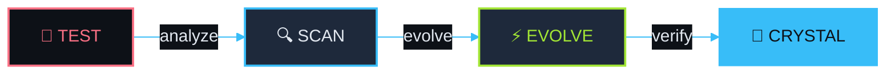
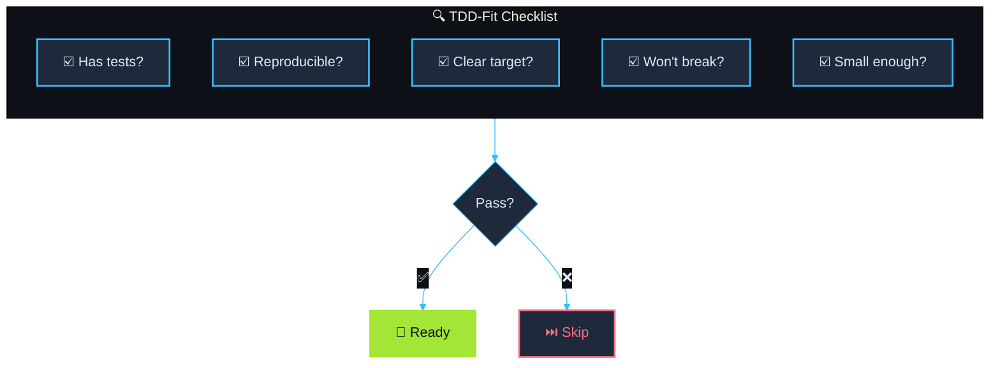
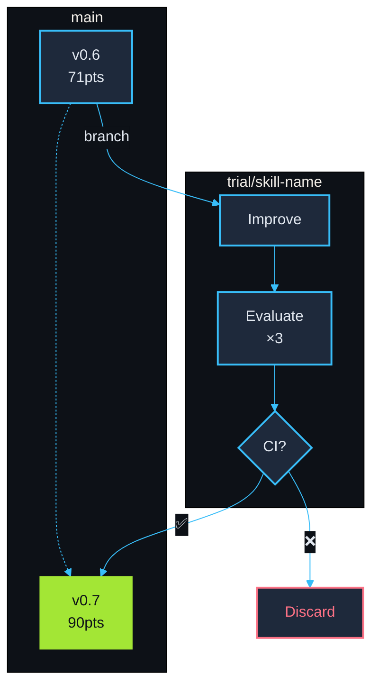
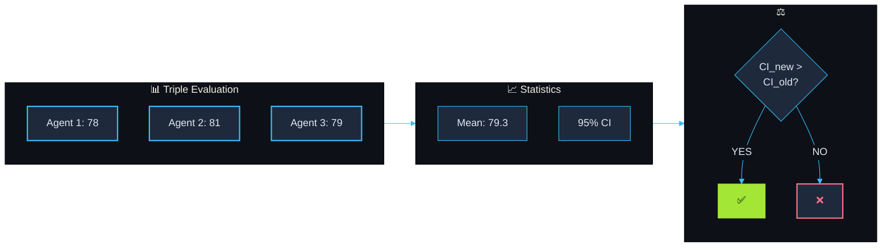
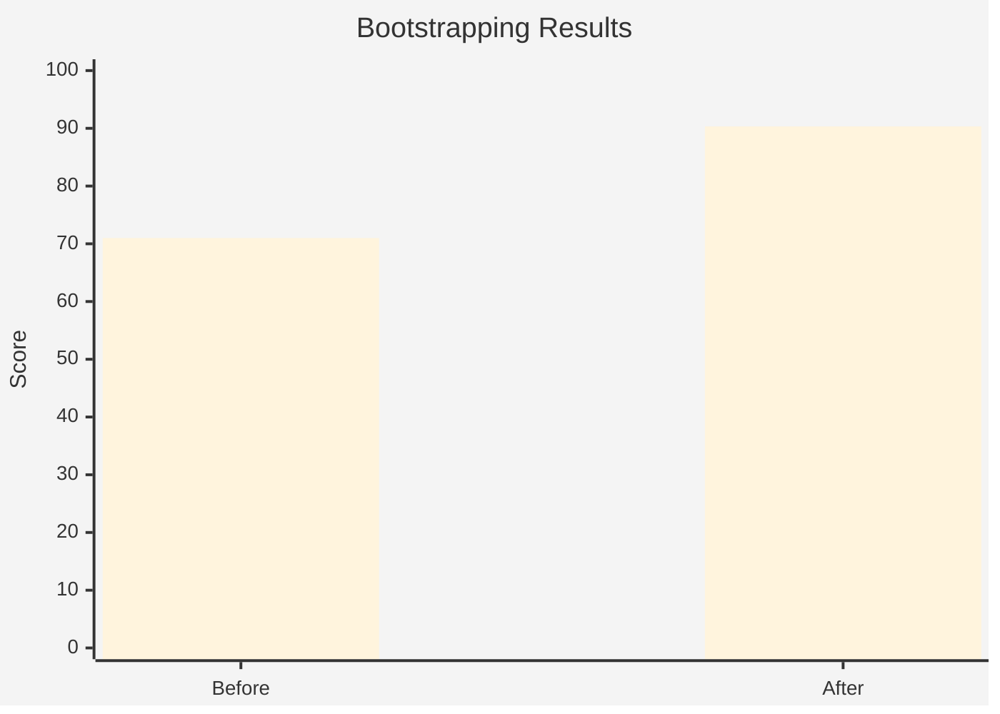
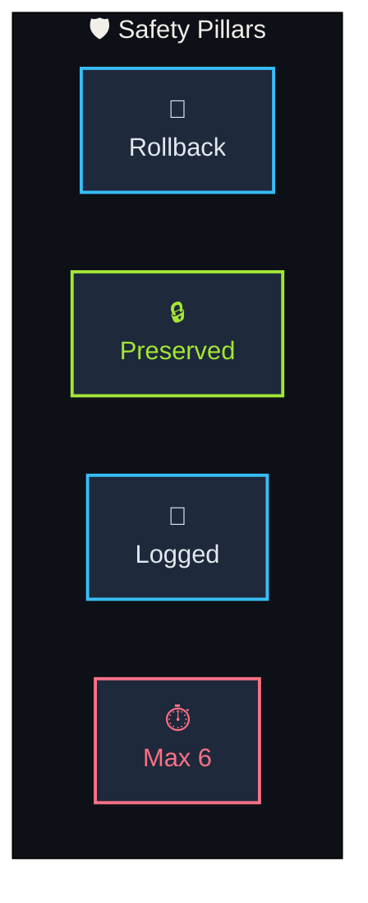
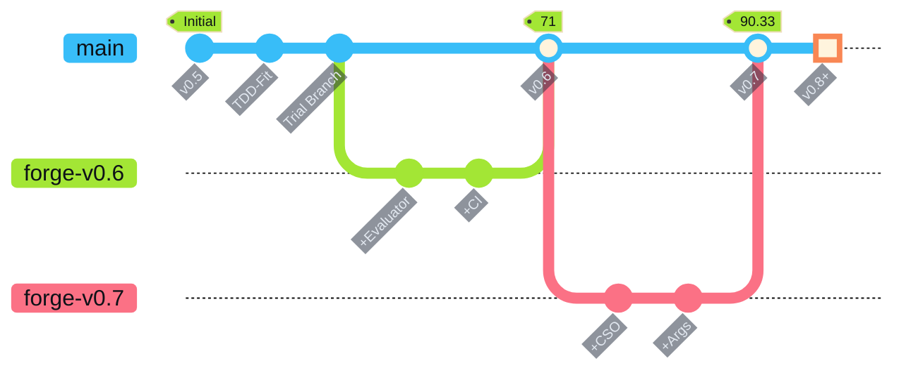
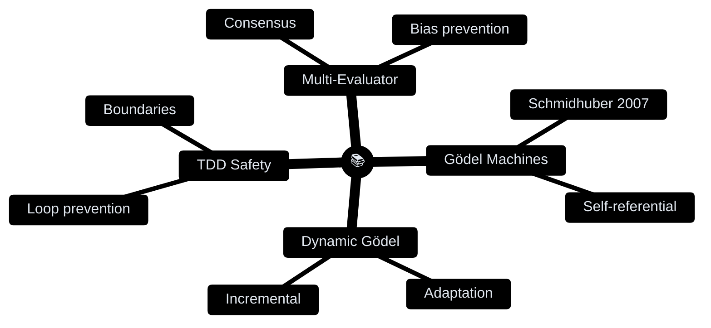

**English** | [한국어](README.ko.md)

<div align="center">

<picture>
  <source media="(prefers-color-scheme: dark)" srcset="https://readme-typing-svg.demolab.com?font=JetBrains+Mono&weight=700&size=42&duration=3000&pause=1000&color=38BDF8&center=true&vCenter=true&width=500&lines=skill-forge">
  
</picture>

### ⟨ The TDD Evolution Engine ⟩

[](https://github.com/quantsquirrel/claude-skill-forge)
[](https://github.com/quantsquirrel/claude-skill-forge)
[](LICENSE)
[](https://github.com/quantsquirrel/claude-skill-forge)

**TDD-powered automatic skill evolution for Claude Code**

</div>

━━━━━━━━━━━━━━━━━━━━━━━━━━━━━━━━━━━━━━━━━━━━━━━━

## 💎 The Flow



━━━━━━━━━━━━━━━━━━━━━━━━━━━━━━━━━━━━━━━━━━━━━━━━

## ⚡ Quick Start

```bash
# Install
git clone https://github.com/quantsquirrel/claude-skill-forge.git \
  ~/.claude/plugins/local/skill-forge

# Run
/skill-forge:forge --scan
```

━━━━━━━━━━━━━━━━━━━━━━━━━━━━━━━━━━━━━━━━━━━━━━━━

## 💎 Features

| 💎 Crystal Clear | ⚡ Auto Evolution |
|:---:|:---:|
| Every change verified by tests | 3x evaluation + 95% CI auto-merge |

| 🔄 Safe Rollback | 📊 Statistics |
|:---:|:---:|
| Original preserved on failure | Real-time score tracking |

### 🔀 Hybrid Upgrade Mode (v0.8)

Skills can now be upgraded through two paths:

| Mode | Condition | Method |
|------|-----------|--------|
| **TDD Mode** | Test files exist | Statistical validation (95% CI) |
| **Heuristic Mode** | No tests | Usage patterns + structure analysis |

```bash
# Check upgrade mode
source hooks/lib/storage-local.sh
get_upgrade_mode "my-skill"  # Returns: TDD_FIT or HEURISTIC
```

### 📊 Skill Monitor (v0.8)

Track skill usage and get upgrade recommendations:

```
/monitor
```

Output:
```
╔══════════════════════════════════════════════════════════════╗
║                    Skill Forge Monitor                        ║
╠══════════════════════════════════════════════════════════════╣
║ Skill                │ Usage │ Trend   │ Mode       │ Pri    ║
╠══════════════════════╪═══════╪═════════╪════════════╪════════╣
║ skill-forge:forge    │    45 │ ▲ +20%  │ TDD_FIT    │ MED    ║
╚══════════════════════════════════════════════════════════════╝
```

### 🎖️ Enhanced Grades (v0.8)

New grade modifiers and SSS tier:

| Modifier | Bonus | Condition |
|----------|-------|-----------|
| Upgraded | +1 | `upgraded: true` |
| Efficient | +0.5 | tokens/usage < 1500 |
| Trending | +0.5 | positive trend |
| Tested | +0.5 | has test files |

**S + Upgraded + Efficient = SSS** ★★★

━━━━━━━━━━━━━━━━━━━━━━━━━━━━━━━━━━━━━━━━━━━━━━━━

## 🔍 TDD-Fit Assessment



━━━━━━━━━━━━━━━━━━━━━━━━━━━━━━━━━━━━━━━━━━━━━━━━

## ⚡ Trial Branch Strategy



━━━━━━━━━━━━━━━━━━━━━━━━━━━━━━━━━━━━━━━━━━━━━━━━

## 📊 Statistical Validation



━━━━━━━━━━━━━━━━━━━━━━━━━━━━━━━━━━━━━━━━━━━━━━━━

## 📊 Results



**+27% improvement** — skill-forge evolved itself

━━━━━━━━━━━━━━━━━━━━━━━━━━━━━━━━━━━━━━━━━━━━━━━━

## 🛡️ Safety



━━━━━━━━━━━━━━━━━━━━━━━━━━━━━━━━━━━━━━━━━━━━━━━━

## 🚀 Commands

| Command | Description |
|---------|-------------|
| `/skill-forge:forge --scan` | 🔍 Scan for upgradeable skills |
| `/skill-forge:forge <skill>` | ⚡ Forge a specific skill |
| `/skill-forge:forge --history` | 📜 View forging history |
| `/skill-forge:forge --watch` | 👁️ Monitor skills |

━━━━━━━━━━━━━━━━━━━━━━━━━━━━━━━━━━━━━━━━━━━━━━━━

## 📈 History



━━━━━━━━━━━━━━━━━━━━━━━━━━━━━━━━━━━━━━━━━━━━━━━━

## 📚 Theory



━━━━━━━━━━━━━━━━━━━━━━━━━━━━━━━━━━━━━━━━━━━━━━━━

<div align="center">

**Inspired by** [skill-up](https://github.com/BumgeunSong/skill-up)

**Claude Code** · **MIT License**

</div>
