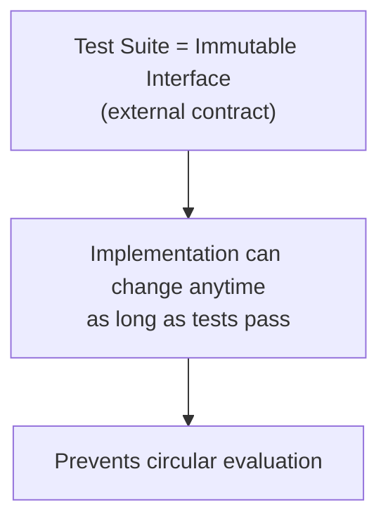
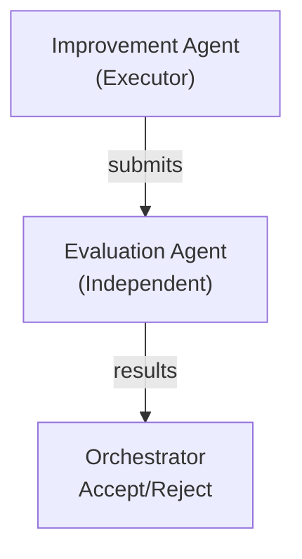
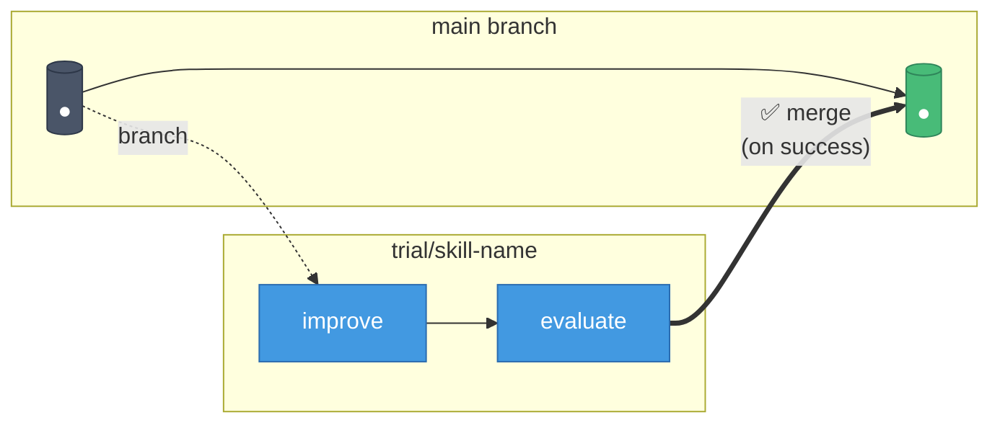
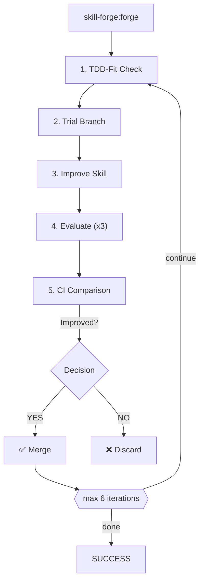

**English** | [한국어](README.ko.md)

<div align="center">

# 🔨 skill-forge

**TDD-Based Automatic Skill Upgrade Plugin for Claude Code**

[](LICENSE)
[](https://github.com/quantsquirrel/claude-skill-forge)
[](https://claude.ai)

*Automatically analyze, evaluate, and improve AI agent skills using Test-Driven Development principles.*

[Quick Start](#-quick-start) · [Features](#-core-features) · [Documentation](#-research-background) · [Contributing](#references)

</div>

---

> **📚 Built on Solid Research**
>
> This project is grounded in proven theories:
> | Foundation | Description |
> |------------|-------------|
> | **Gödel Machines** | Provable self-improvement (Schmidhuber, 2007) |
> | **Dynamic Gödel Machines** | Incremental optimization in dynamic environments |
> | **TDD Safety** | Change boundaries defined by tests |
> | **Statistical Validation** | 95% confidence interval verification |

---

## ⚡ Quick Start

```bash
# Clone to Claude plugins directory
git clone https://github.com/quantsquirrel/claude-skill-forge.git \
  ~/.claude/plugins/local/skill-forge

# Start upgrading skills
/skill-forge:forge --scan
```

---

## 📋 Table of Contents

- [🔬 Research Background](#-research-background)
- [🏗️ Design Decisions](#️-design-decisions)
- [✨ Core Features](#-core-features)
- [📦 Installation](#-installation)
- [🚀 Usage](#-usage)
- [📈 Self-Improvement History](#-self-improvement-history)
- [📚 References](#-references)

---

## 🔬 Research Background

### Self-Improving Skills: The Possibility of Self-Improving AI

This plugin is inspired by groundbreaking research:

| Research | Key Insight |
|----------|-------------|
| **Gödel Machines** (Schmidhuber) | AI can provably improve its own algorithms |
| **Dynamic Gödel Machines** | Skills can be relearned and improved in dynamic environments |

### TDD and Self-Reference Safety

**Core insight:** Tests define the boundaries of change



### 6-Iteration Optimization Curve

| Iteration | Improvement | Status |
|-----------|-------------|--------|
| 1-2 | >10% gain | 🚀 Rapid |
| 3-4 | 5-10% | 📈 Stable |
| 5-6 | <5% | ⚠️ Diminishing |
| 7+ | Regression risk | 🛑 Stop |

> Maximum **6 iterations** to balance improvement vs. stability.

---

## 🏗️ Design Decisions

### Core Design Principles

#### 1️⃣ Evaluator Agent Separation

❌ **Unsafe:** Improvement Agent → Evaluates own results → Bias/Circular

✅ **Correct:**



#### 2️⃣ Multiple Evaluations + Confidence Intervals

| Strategy | Details |
|----------|---------|
| Evaluations | 3 independent rounds |
| Scoring | 0-100 per round |
| Statistics | Mean, StdDev, 95% CI |
| Threshold | `CI_lower(new) > CI_upper(old) + 5%` |

#### 3️⃣ Trial Branch Strategy



> On failure, trial branch is discarded without merging.

### Implementation Details

#### Lazy Detection

| Method | Trigger | Overhead |
|--------|---------|----------|
| Aggressive | Every tool use | 100% |
| **Lazy** ✅ | Write/Edit only | **~2%** |

> **98% overhead reduction** by detecting only on file writes.

---

## ✨ Core Features

### 1. TDD-Fit Assessment

```
☑ Has tests?
☑ Tests reproducible?
☑ Clear improvement target?
☑ Won't break existing functionality?
☑ Small skill (<500 lines)?

  → All YES = ✅ TDD-fit certified
  → Any NO  = ⏭️ Skip
```

### 2. Quality Scoring (0-100)

| Factor | Weight | Criteria |
|--------|--------|----------|
| Test Pass Rate | 30% | 100% = 30pts |
| Code Clarity | 20% | Comments, naming |
| Performance | 20% | vs. previous |
| Completeness | 20% | Edge cases |
| Maintainability | 10% | Complexity |

### 3. Automatic Upgrade Loop



### 4. Safe Rollback

- ✅ Trial branch deleted on failure
- ✅ Original skill preserved
- ✅ Failure logged for learning
- ✅ Pattern analysis enabled

---

## 📦 Installation

### Option 1: Auto-load (Recommended)

```bash
# Clone directly to Claude plugins
git clone https://github.com/quantsquirrel/claude-skill-forge.git \
  ~/.claude/plugins/local/skill-forge
```

### Option 2: Manual Installation

```bash
# Create directory
mkdir -p ~/.claude/plugins/local/skill-forge

# Copy files
cp -r skill-forge/* ~/.claude/plugins/local/skill-forge/

# Set permissions
chmod +x ~/.claude/plugins/local/skill-forge/hooks/*.sh
```

---

## 🚀 Usage

### Commands

| Command | Description |
|---------|-------------|
| `/skill-forge:forge --scan` | Scan upgradeable skills |
| `/skill-forge:forge <skill>` | Upgrade specific skill |
| `/skill-forge:forge --history` | View upgrade history |
| `/skill-forge:forge --watch <skills>` | Monitor skills |

### Example: Upgrade a Skill

```bash
/skill-forge:forge executor
```

**Output:**
```
[1/6] executor 업그레이드 중...

Trial Branch: trial/executor
✓ Improvement agent completed
  → Performance: -20% memory
  → Clarity: Added comments

Evaluation (3 rounds):
  Round 1: 78  Round 2: 81  Round 3: 79

Statistics:
  Mean: 79.3 | StdDev: 1.53 | 95% CI: [76.8, 81.8]

Baseline: 75 (CI: [72, 78])

✅ Improvement confirmed: CI_lower(76.8) > CI_upper(78)? YES
→ Merged to main
```

---

## 📈 Self-Improvement History

| Version | Score | Changes |
|---------|-------|---------|
| v0.5 | N/A | Initial: TDD-Fit, Trial Branch |
| v0.6 | 71 | +Evaluator separation, +CI validation |
| **v0.7** | **90.33** (+19) | +CSO compliance, +Arguments, +Prerequisites |
| v0.8+ | 🚧 | Planned: Additional bootstrapping |

---

## 📚 References

| Reference | Description |
|-----------|-------------|
| [Gödel Machines](https://arxiv.org/abs/cs/0309048) | Schmidhuber (2007) - Self-referential optimal agents |
| Dynamic Gödel Machines | Dynamic environment adaptation |
| TDD Safety | Self-referential loop prevention |
| Multi-Evaluator Consensus | Reliability through agreement |

---

<div align="center">

*Inspired by [skill-up](https://github.com/BumgeunSong/skill-up)*

**Maintained by:** Claude Code · **License:** MIT

</div>
