**English** | [한국어](README.ko.md)

<div align="center">

```
                    ╔═══════════════════════════════════════╗
                    ║                                       ║
        ⚒️          ║     S K I L L   F O R G E            ║          🔥
                    ║                                       ║
                    ╚═══════════════════════════════════════╝
                                    ▲
                               ╱────┴────╲
                              ╱   ANVIL   ╲
                             ▕  ▓▓▓▓▓▓▓▓▓  ▏
                              ╲___________╱
```

### Where AI Skills Are Forged Through Fire

**TDD-Based Automatic Skill Upgrade Plugin for Claude Code**

[](LICENSE)
[](https://github.com/quantsquirrel/claude-skill-forge)
[](https://claude.ai)
[](https://github.com/quantsquirrel/claude-skill-forge)
[](https://github.com/quantsquirrel/claude-skill-forge)

<br/>

> *"Like a master blacksmith tempering steel, skill-forge heats, hammers, and quenches*
> *your AI skills until they emerge stronger than before."*

<br/>

[⚡ Quick Start](#-ignite-the-forge) · [🔥 The Process](#-the-forging-process) · [📊 Results](#-proof-of-the-flame)

</div>

---

<table>
<tr>
<td width="50%">

### 🏛️ Built on Proven Theory

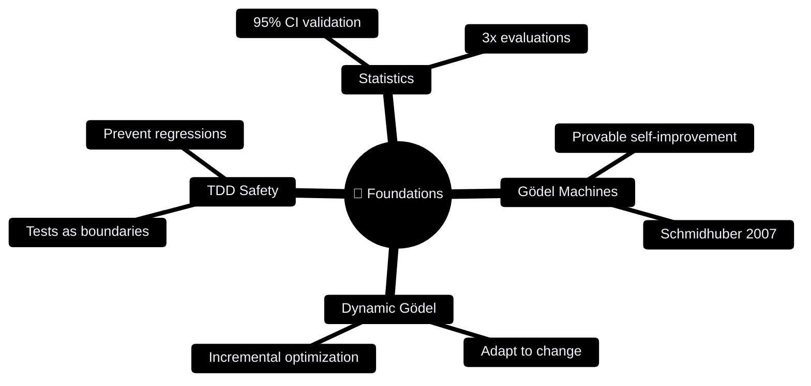

</td>
<td width="50%">

### 📊 Proof of the Flame

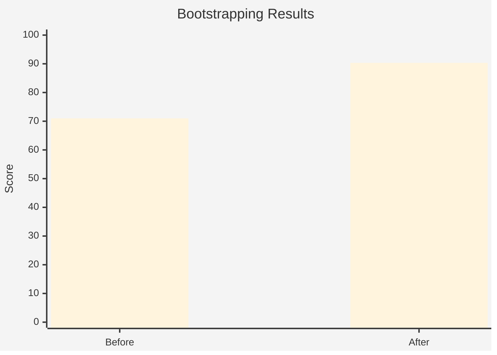

**+27% improvement** — *skill-forge forged itself*

</td>
</tr>
</table>

---

## ⚡ Ignite the Forge

```bash
# Summon the forge to your workshop
git clone https://github.com/quantsquirrel/claude-skill-forge.git \
  ~/.claude/plugins/local/skill-forge

# Strike the first spark
/skill-forge:forge --scan
```

---

## 🔥 The Forging Process

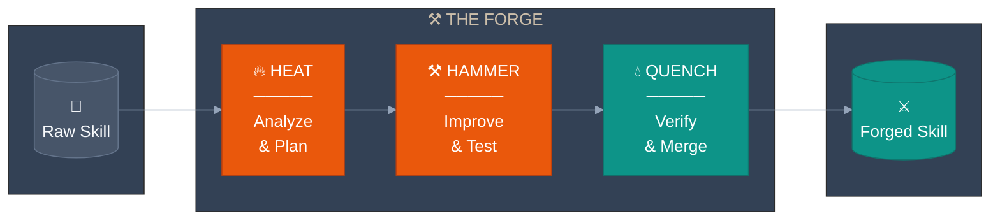

---

### 🔥 HEAT: TDD-Fit Assessment

Before any skill enters the forge, it must pass the heat test:

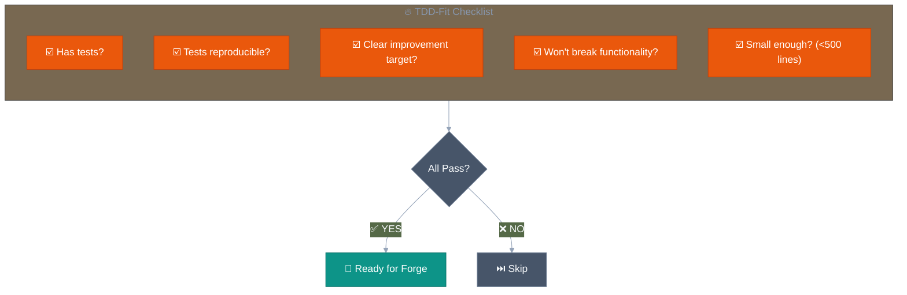

---

### ⚒️ HAMMER: Trial Branch Strategy

The skill is hammered on a separate anvil (branch) for safety:

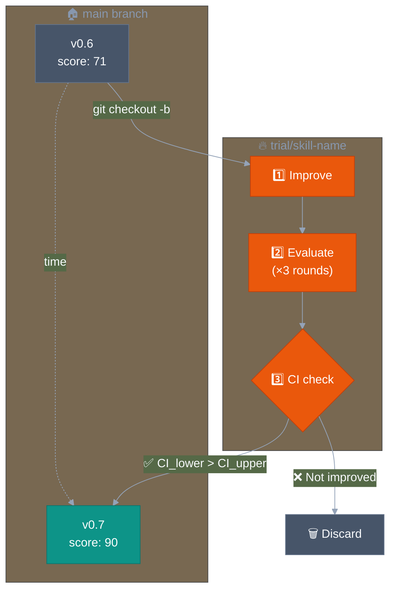

---

### 💧 QUENCH: Statistical Validation

Only statistically significant improvements survive:

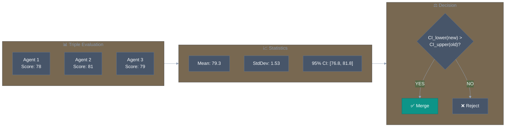

---

## ⚔️ Quality Scoring

Each skill is scored across five dimensions:

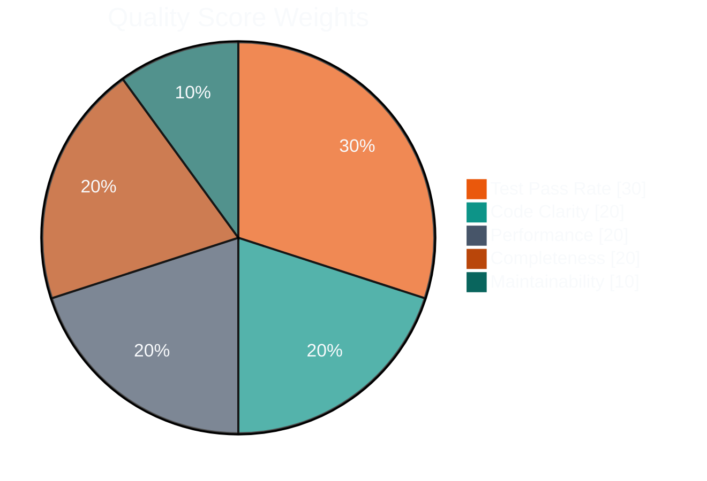

---

## 🛡️ Safety Mechanisms

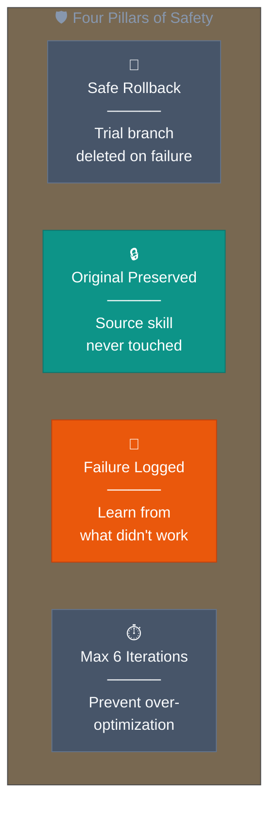

---

## 📦 Installation

<details>
<summary><b>Option 1: Auto-load (Recommended)</b></summary>

```bash
git clone https://github.com/quantsquirrel/claude-skill-forge.git \
  ~/.claude/plugins/local/skill-forge
```

</details>

<details>
<summary><b>Option 2: Manual Installation</b></summary>

```bash
mkdir -p ~/.claude/plugins/local/skill-forge
cp -r skill-forge/* ~/.claude/plugins/local/skill-forge/
chmod +x ~/.claude/plugins/local/skill-forge/hooks/*.sh
```

</details>

---

## 🚀 Commands

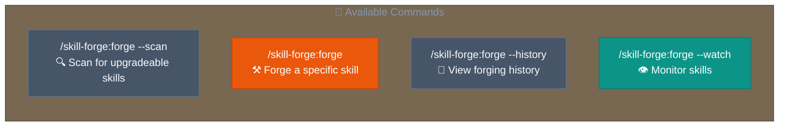

---

## 📈 Forging History

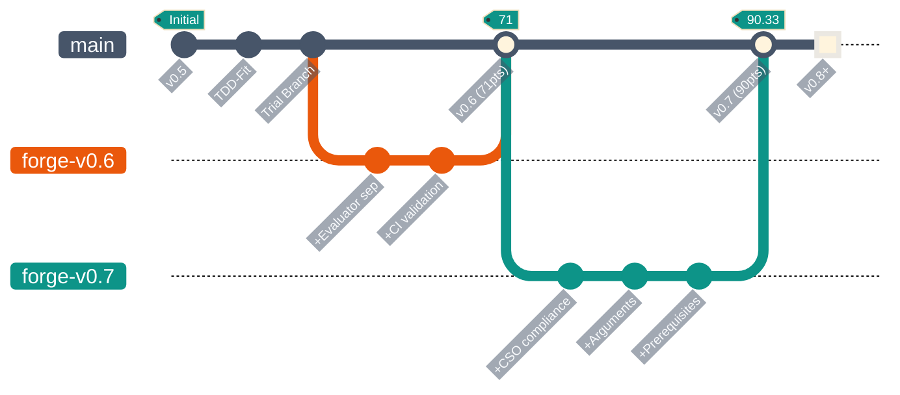

---

## 📚 The Lore (References)

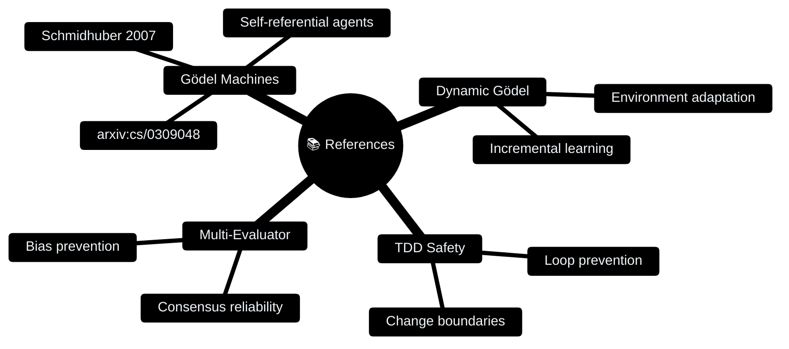

---

<div align="center">

```
        ╱╲
       ╱  ╲
      ╱ 🔥 ╲
     ╱      ╲
    ╱________╲
   ╱ ▓▓▓▓▓▓▓▓ ╲
  ╱____________╲
       ║║
    ═══╬╬═══
```

*"A skill forged in fire is a skill that will never tire."*

---

Inspired by [skill-up](https://github.com/BumgeunSong/skill-up)

**Maintained by:** Claude Code · **License:** MIT

</div>
